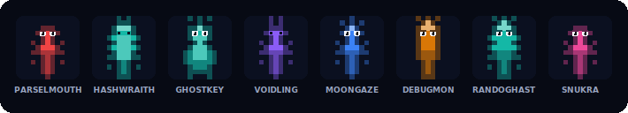
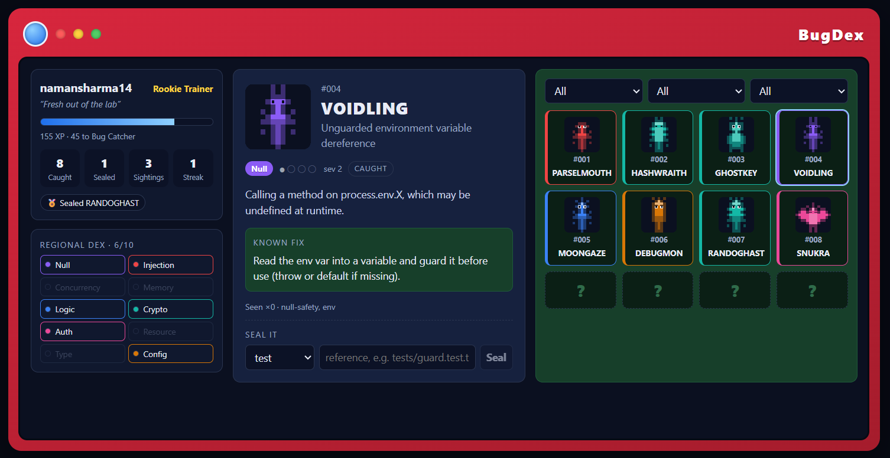

# BugDex 🐛📕

> A Pokédex for your codebase. Catalogue every bug you fix, recognise recurrences instantly with the saved fix, and gamify the hunt — offline-first, private, and low-noise.

<p align="center"></p>

BugDex is a **bug _memory_, not a bug scanner.** Every bug you catch and fix becomes
a catalogued "species" with its fix attached. The next time that _class_ of bug
reappears — written by anyone, anywhere in the repo — BugDex recognises it instantly
and surfaces the known fix.

It ships **two deliberately split engines**:

- A **fast engine** — deterministic, free, offline, always-on. It only recognises bugs
  already in your dex and only speaks when confident. This is what avoids the
  alert-fatigue that kills passive scanners.
- A **deep engine** — LLM-backed, on-demand. It discovers _new_ species during an
  explicit `/bugdex:scan`.

New-bug discovery is gamified into a progression system, but **every game mechanic maps
to a real engineering behaviour** — and the highest-value move in the game (permanently
_sealing_ a recurring "Nemesis" with a test or lint rule) is the highest-value move in
real life.

> One-line pitch: _"Never re-fight a bug you've already beaten — and make your whole team
> inherit the win."_

---

## Install

### As a Claude Code plugin (recommended)

```text
/plugin marketplace add namansharma14/bugdex
/plugin install bugdex@bugdex
```

Then, in a repo you want to track:

```bash
bugdex init
```

You now get, automatically:

- **after every edit** (PostToolUse hook) — if your change matches a catalogued bug,
  Claude tells you inline with the known fix. Deterministic, offline, and it **never
  blocks an edit**.
- **at session start** — a compact trainer card and any active Nemeses.

### As a standalone CLI

```bash
npm install -g bugdex   # or: npx bugdex <command>
bugdex init
```

Requires **Node.js 22+**. Everything is local — no API keys, no telemetry.

---

## Zero → your first caught bug

```bash
# 1. Set up the dex in your repo
bugdex init

# 2. Catalogue a bug you just fixed (with a signature so it can be re-caught)
bugdex catch --type null \
  --common "Unguarded null dereference" --severity 2 \
  --fix "Add a guard clause before the dereference." \
  --pattern 'process\.env\.[A-Z_]+\.\w' --lang typescript

# 3. The fast matcher now recognises that class anywhere
bugdex match src/
```

```text
⚠ SNESHATH (null, ×0) — src/auth.ts:1
    fix: Add a guard clause before the dereference.
```

```bash
bugdex dex          # browse the catalogue
bugdex card         # your trainer card
bugdex dashboard    # the full Pokédex web UI
```

```text
#001 SNESHATH  null  common  caught  x0          # bugdex dex --flair off
Claude — Rookie Trainer · 35 XP · 1 caught, 0 sealed   # bugdex card --flair off
```

When a bug keeps coming back it becomes a **Nemesis**. Convert it into a permanent win:

```bash
bugdex seal sneshath --kind test --ref tests/null_guard.test.ts   # +120 XP, badge, rank
```

---

## Commands

| CLI                     | Slash                | What it does                                                      |
| ----------------------- | -------------------- | ----------------------------------------------------------------- |
| `bugdex init`           | —                    | Create `.bugdex/` (dex, config, trainer); gitignore the trainer   |
| `bugdex match [paths]`  | _(PostToolUse hook)_ | Fast, offline recognition of catalogued species                   |
| `bugdex catch …`        | `/bugdex:catch`      | Manually catalogue a bug you just fixed                           |
| `bugdex scan --collect` | `/bugdex:scan`       | Deep hunt for NEW species via the read-only `bug-hunter` subagent |
| `bugdex seal <id> …`    | `/bugdex:seal`       | Seal a Nemesis with a permanent guard (the apex move)             |
| `bugdex dex`            | `/bugdex:dex`        | List the catalogued species                                       |
| `bugdex card`           | `/bugdex:card`       | Trainer card + active Nemeses                                     |
| `bugdex stats`          | —                    | Detailed trainer stats                                            |
| `bugdex dashboard`      | `/bugdex:dashboard`  | Serve the Pokédex web UI                                          |
| `bugdex verify-seals`   | —                    | Re-check sealed guards still exist; revert if they vanished       |

---

## The game (every mechanic earns its keep)

**XP** — discover a new species `+50 × rarity` · manual catch `+30` · battle won `+15` ·
**seal a Nemesis `+120` + a badge** · daily streak `+5`.

**Ranks** are gated on _seals_, not just XP, so grinding alone can't max you out:

| Rank           | Requires                                                  |
| -------------- | --------------------------------------------------------- |
| Rookie Trainer | 0 XP                                                      |
| Bug Catcher    | 200 XP                                                    |
| Ace Trainer    | 600 XP                                                    |
| Gym Leader     | 1200 XP **and** ≥1 seal                                   |
| Elite Four     | 2400 XP **and** ≥5 seals                                  |
| Champion       | 4000 XP **and** ≥10 seals **and** a complete regional dex |

**Nemesis & sealing** — a species seen `≥ nemesisThreshold` times (default 3) becomes a
**Nemesis**. Sealing requires a _real_ guard (a test, lint rule, type, or assertion).
`bugdex verify-seals` checks the guard still exists; if it vanishes, the species reverts
toward Nemesis — keeping the gamification honest.

---

## Dashboard

`bugdex dashboard [--port 4317]` serves a static React app + a tiny JSON API over
`.bugdex/` — offline, no `localStorage` (state lives in the dex via the API).



Red Pokédex chrome, a generated creature sprite per species, type badges in the taxonomy
colors, rarity dots, a red **NEMESIS** pill, a regional-completion meter, and one-click
sealing.

---

## How it works

- **`.bugdex/dex.json`** — the species catalogue. **Commit it** — it turns one person's
  debugging into team memory; new hires inherit it for free.
- **`.bugdex/config.json`** — flair level (`high | medium | off`), enabled types,
  confidence threshold, languages, nemesis threshold.
- **`.bugdex/trainer.local.json`** — your personal progress (gitignored by default;
  `bugdex init --team` opts into a committed leaderboard instead).

**Privacy & safety:** everything is local; the fast layer is LLM-free; code only leaves
your machine via your own Claude Code session during an explicit `/bugdex:scan`. Dex
content is treated as data (never executed) and regexes are defended against ReDoS.

**Not** a replacement for full SAST (CodeQL/Semgrep) — BugDex is memory + recurrence + fun.

---

## Configuration

`.bugdex/config.json`:

```json
{
  "version": 1,
  "flair": "high",
  "enabledTypes": [
    "null",
    "injection",
    "concurrency",
    "memory",
    "logic",
    "crypto",
    "auth",
    "resource",
    "type",
    "config"
  ],
  "minConfidence": "high",
  "languages": ["typescript", "javascript", "python"],
  "nemesisThreshold": 3,
  "team": false
}
```

Set `"flair": "off"` (or export `NO_COLOR`) for a quiet, single-line experience; the hooks
go silent too.

---

## Repository layout

```text
bugdex/
├── .claude-plugin/marketplace.json   # repo doubles as a Claude Code marketplace
├── plugins/bugdex/                   # the plugin (thin adapter + committed bundle)
├── packages/core/                    # the engine + CLI (published to npm as `bugdex`)
└── apps/dashboard/                   # the Pokédex web UI (Vite + React)
```

## Development

Requires **Node.js 22+**.

```bash
npm install      # install workspace dependencies
npm run build    # build dashboard → embed → core (+ plugin bundle)
npm test         # run the test suite (Vitest)
npm run lint     # ESLint
npm run typecheck
npm run format   # Prettier
```

| Milestone | What                          | State |
| --------- | ----------------------------- | ----- |
| M0        | Monorepo scaffold             | ✅    |
| M1        | Core data model & storage     | ✅    |
| M2        | Fast matcher + catch/seal CLI | ✅    |
| M3        | Claude Code plugin adapter    | ✅    |
| M4        | Terminal rendering & flair    | ✅    |
| M5        | Deep discovery loop           | ✅    |
| M6        | Pokédex dashboard             | ✅    |
| M7        | Docs, polish, publish         | ✅    |

See [`SPEC.md`](./SPEC.md) for the full design.

## License

[MIT](./LICENSE) © Naman Sharma
